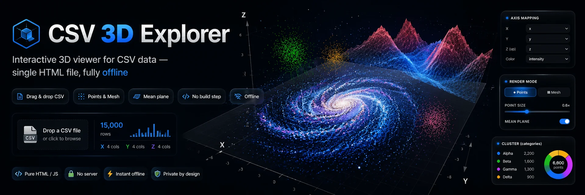
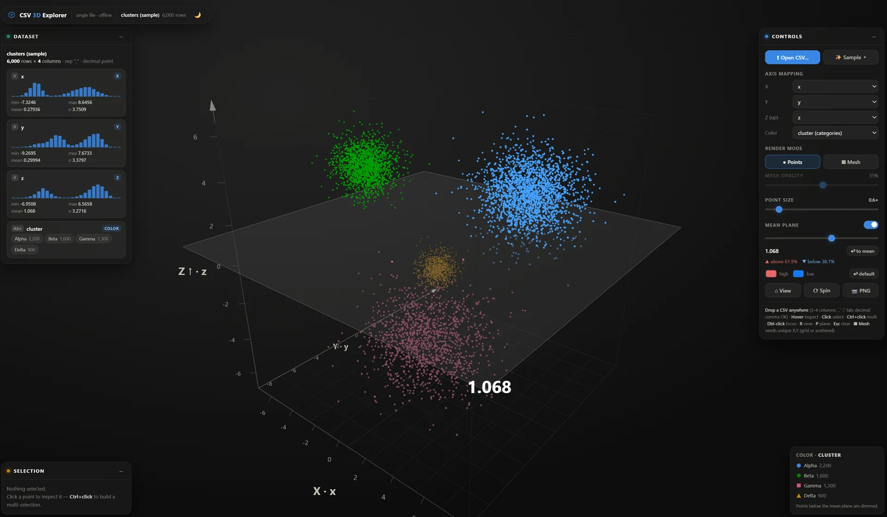
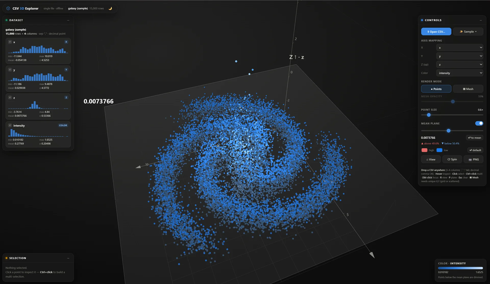
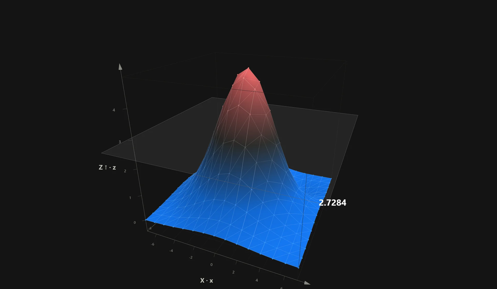
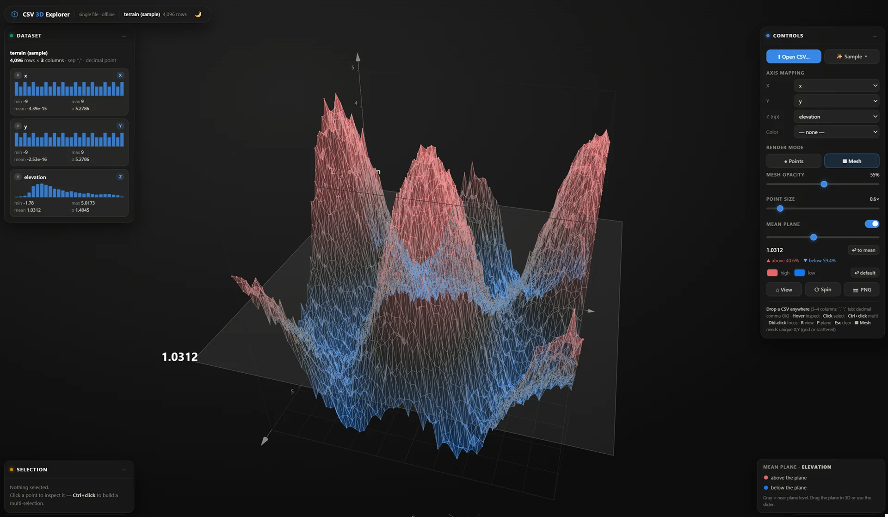

<p align="center">
  
</p>

# CSV 3D Explorer

An interactive 3D viewer for CSV data in **a single HTML file, fully offline** (Three.js r147 embedded).
Double-click `index.html` and you're done — no server, no build step, no internet.

```
3d_viewer/
├── index.html     ← the whole application (~720 KB, self-contained)
├── images/        ← screenshots used in this README
└── samples/       ← ready-to-drop example CSVs
```

## Quick start

1. Open `index.html` in any modern browser (WebGL 2 required).
2. It boots with the *Spiral galaxy* sample so there is something on screen immediately.
3. Drop one of the files from `samples/` onto the window, or click **⬆ Open CSV…** to load your own.

## The interface



Three floating panels surround the scene, and all of them drag by their header and collapse with `–`:

- **Dataset** (left) — file name, row/column count, the detected separator and decimal mark, plus a histogram per column with min, max, mean and σ. Badges mark which column feeds X, Y, Z and Color.
- **Controls** (right) — loading, axis mapping, render mode, point size, the mean plane and its tint, and the view buttons.
- **Selection** (bottom left) — the values of whatever you clicked.

A legend appears bottom-right whenever a *Color* column is active.

## Loading data

- **Open CSV…** opens a file picker; you can also **drag and drop** a `.csv`, `.tsv` or `.txt` anywhere on the window.
- **✨ Sample ▾** generates synthetic datasets in memory: *Spiral galaxy* (15,000 points, numeric 4th column), *Clusters* (6,000 points, categorical 4th column), *Terrain wave* (4,096 points, 3 columns, mesh-ready) and *Simple grid* (225 points, a tiny 15×15 grid for trying Mesh mode).

### CSV format

The parser is deliberately forgiving and auto-detects almost everything:

| Aspect | Supported |
|---|---|
| Delimiter | `,` `;` tab `\|` — sniffed from the file |
| Decimal mark | Dot or comma — **Spanish-style `1.234,56` works** |
| Header | Detected automatically; without one, columns are named `col 1`, `col 2`, … |
| Quoting | RFC 4180 (`"a,b"`, escaped `""`) |
| Encoding | UTF-8, falling back to Windows-1252 when replacement chars appear |
| Numbers | Scientific notation and negatives (`-1.5e3`, `2E-2`) |
| Columns | 3 or more — extra columns stay available in the mapping selectors |

Malformed rows are dropped rather than aborting the load, and the toast reports how many were skipped. Files are truncated at **500,000 rows**.

## Mapping columns

The first three numeric columns are assigned to X·Y·Z (**Z is the vertical axis**) and the next one becomes *Color*. Everything is remappable live from the **Controls** panel — pick any column for any axis without reloading.

## The 4th dimension: color

- **Numeric column** → blue gradient with a legend showing the value range.
- **Text column** → the 4 most frequent categories get a distinct color **and shape** (circle / diamond / square / triangle); everything else is grouped into *Other*. This is what the *Clusters* screenshot above shows.
- **No column** → a single flat color, which is what lets the mean plane tint take over (see below).



## Mean plane / flotation surface

Toggle it in *Mean plane* (or press **P**). It starts at the mean of the Z axis and moves with the slider **or by dragging it directly in 3D**. It reports the percentage of points above and below.

- Without a *Color* column it tints the cloud: **warm above, cool below**.
- With a *Color* column it dims what sits underneath instead, so your palette stays readable.
- **↩ to mean** snaps it back to the average.



### Custom high/low tint

The **high** and **low** color pickers in the *Mean plane* group redefine the high→low gradient anchored to the plane (it drives points and mesh whenever there is no *Color* column). **↩ default** restores the theme colors. The choice is remembered across sessions.

## Mesh mode

**▦ Mesh** becomes available when the X,Y pairs are **unique** (one Z per X,Y) — otherwise the button stays disabled with a "Needs unique X,Y pairs" hint. It triangulates the surface:

- a **regular grid** when the data forms a lattice, or **Delaunay** triangulation when the points are scattered;
- **adjustable transparency** (opacity slider), visible wireframe and **highlighted nodes** (the connection points);
- hover and selection keep working on the nodes;
- enabling it automatically turns the flotation surface on at the mean of Z.



## Themes

The 🌙/☀ button in the top bar switches between dark and light. It restyles the scene background, panels, color palettes (each one validated against its background) and the PNG snapshots. The preference persists across sessions.

## Controls

| Action | Gesture |
|---|---|
| Rotate / zoom / pan | drag / wheel / right button |
| Inspect a point | hover (tooltip) |
| Select | click · **Ctrl+click** to multi-select · click empty space or **Esc** to clear |
| Center the camera on a point | double-click |
| Reset view | **R** or ⌂ View |
| Toggle mean plane | **P** |
| Auto-rotate | ⟳ Spin |
| Save snapshot | 📷 PNG |

Point size (and mesh opacity in mesh mode) have their own sliders in *Controls*. The floating panels — **Dataset**, **Selection**, **Controls** — drag by their header and collapse with `–`.

## URL parameters

Handy for demos, screenshots and automated checks:

| Parameter | Values | Effect |
|---|---|---|
| `?sample=` | `galaxy` · `clusters` · `terrain` · `simplegrid` | Boot with that dataset (defaults to `galaxy`) |
| `?mode=mesh` | — | Start in mesh mode |
| `?plane=1` | — | Start with the mean plane on |
| `?spin=1` | — | Start auto-rotating |
| `?theme=` | `dark` · `light` | Force a theme, ignoring the saved preference |
| `?test=parser` | — | Run the parser self-tests in-page |

They combine: `index.html?sample=terrain&mode=mesh&spin=1`.

## `samples/`

| File | What it exercises |
|---|---|
| `galaxy.csv` | 15k rows, numeric 4th column → gradient + legend |
| `clusters.csv` | 6k rows, categorical 4th column → colors + shapes |
| `terrain.csv` | 3 columns, 64×64 grid → ideal for mesh mode |
| `malla_simple.csv` | Small 15×15 grid to try mesh mode |
| `ventas_es.csv` | Spanish format (`;` delimiter, decimal comma) |
| `dirty.csv` | Corrupt rows, to see the skip/report path |

All of them are deterministic (seeded generator), so screenshots stay reproducible.

## Technical notes

`index.html` is a concatenation of four `<script>` blocks:

1. **Three.js r147** (minified, MIT) — embedded for offline use
2. **OrbitControls** r147 (MIT)
3. **Delaunator 5.0.1** (ISC) — triangulation for scattered-XY meshes
4. **The application code** — unminified and meant to be read and edited directly in place

There is no build step: the last `<script>` block *is* the source. Preferences (theme and custom tint) live in `localStorage` under `csv3d.prefs`.

For automated testing, the app exposes `window.__app` with `parseCSV`, `loadText(text, name)`, `state`, `worldToScreen(x,y,z)`, `screenOfIndex(i)`, `camInfo()` and `themeInfo()`.
